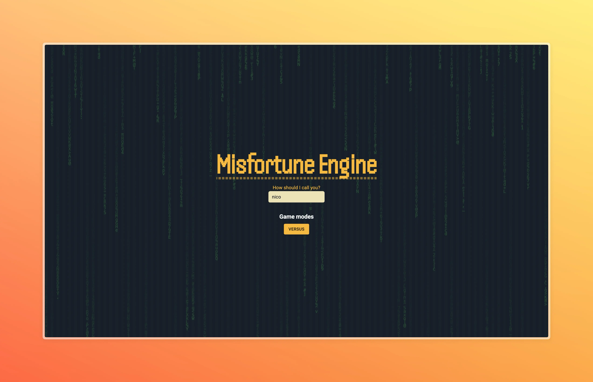

# Misfortune Engine

Misfortune Engine is a game where an AI tries to kill you and your friends in many ways. Your objective is to survive it!
The AI will judge if your strategy worked and give you points for it. At the end of the game, the survivor with the most points is declared the winner, or how it calls, the Misfortune Master.

## How I used SuperViz

The AI used is **OpenAI GPT-4o**.
It also relies on [SuperViz](https://superviz.com) for some features:

- **Realtime Data Engine** for doing the multiplayer and state synchronization.
- **Video SDK** for enabling communication between players.

## Website

You can access it via [misfortune-engine website](https://misfortune-engine.vercel.app).
Select your username, create a room and share it with your friends! (You can also play alone if you use an incognito tab or another browser for the 2nd player).

## Team and links

The project was developed solo and in one day *sigh*
